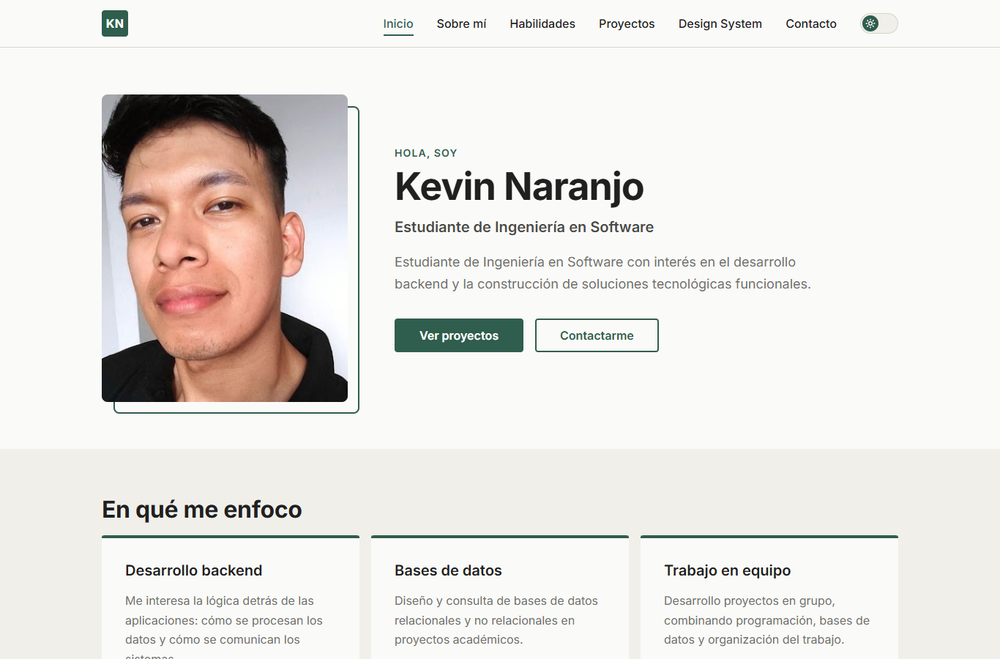
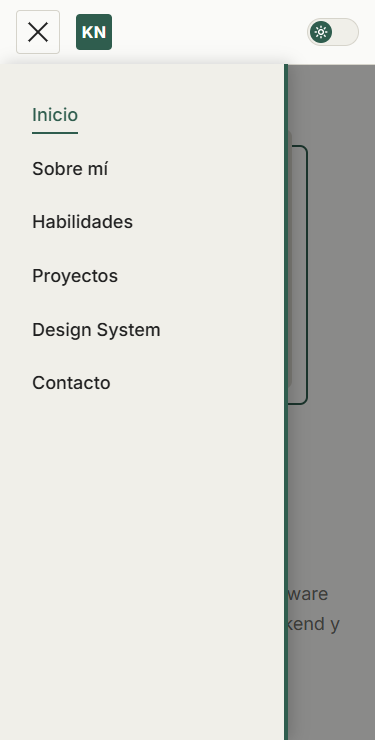
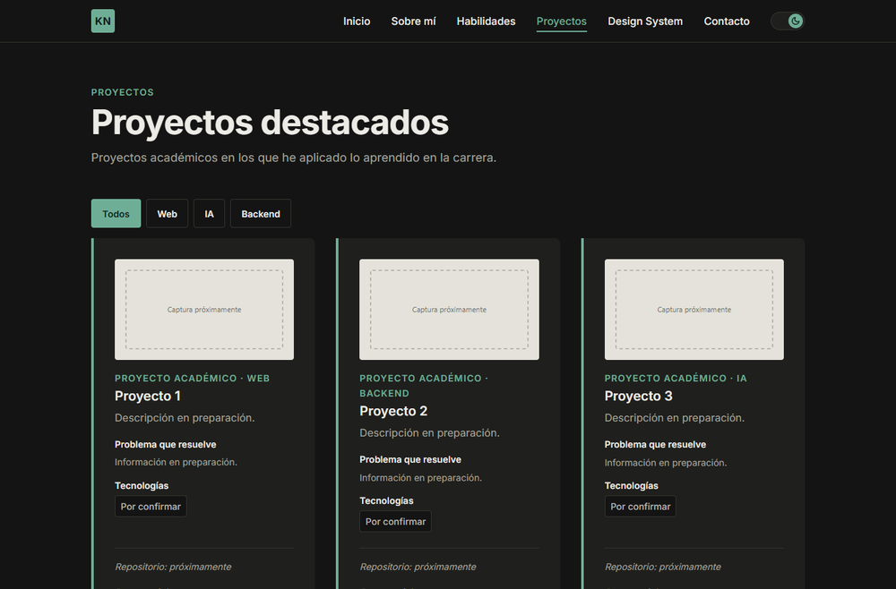
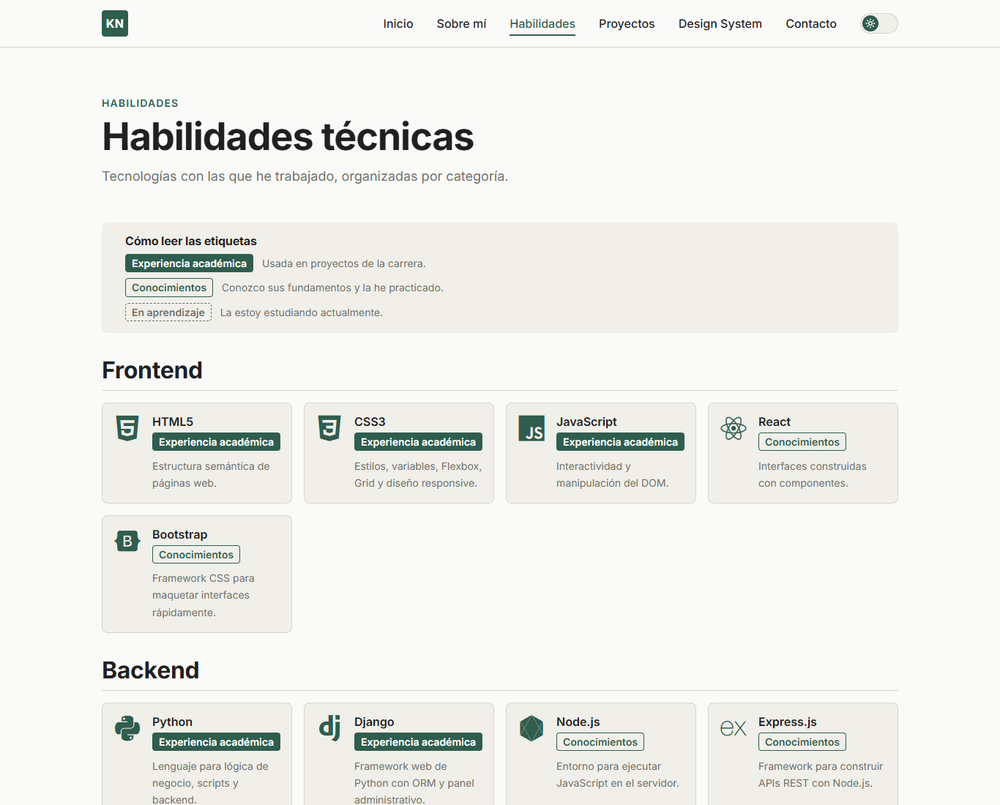

# Portafolio Web Personal — Kevin Naranjo

Portafolio web personal e interactivo de **Kevin Favio Naranjo Morán**, estudiante de
Ingeniería en Software en la Universidad Estatal de Milagro (UNEMI).

Proyecto desarrollado para la tarea S2-TAREA_1 de la asignatura **Desarrollo Web [ISO08DW]**.
El objetivo es presentar mi perfil académico y profesional, mis habilidades técnicas y mis
proyectos destacados, aplicando HTML5 semántico, CSS propio y JavaScript.

**Sitio publicado:** https://kevinnaran07-sudo.github.io/portafolioWeb/

## Tecnologías

- HTML5 semántico
- CSS3 propio (Custom Properties, Flexbox, Grid y media queries), sin frameworks
- JavaScript (sin librerías)
- Git, GitHub y GitHub Pages
- Recursos externos: fuente [Inter](https://fonts.google.com/specimen/Inter) e íconos [Devicon](https://devicon.dev/)

## Características

- **Seis páginas:** Inicio, Sobre mí, Habilidades, Proyectos, Design System y Contacto, con un footer común.
- **HTML semántico:** `header`, `nav`, `main`, `section`, `article`, `aside`, `figure` y `footer`, con un solo `h1` por página.
- **SEO:** título y descripción propios en cada página, `lang="es"`, Open Graph y favicon.
- **Responsive:** funciona en escritorio, tablet y móvil sin scroll horizontal.
- **Design System:** documenta los colores, la tipografía, el espaciado y los componentes reales del sitio.
- **Funcionalidades en JavaScript:**
  1. **Menú lateral (drawer)** en móvil y tablet: se abre desde el botón de la izquierda y se cierra con la tecla Esc, al tocar fuera o al elegir un enlace.
  2. **Modo claro/oscuro** con un switch deslizante; la preferencia se guarda en `localStorage`.
  3. **Filtro de proyectos** por categoría (Todos, Web, IA y Backend).
  4. **Validación del formulario de contacto** con mensajes de error claros para cada campo.

## Estructura

```
├── index.html            Inicio / Presentación
├── sobre-mi.html         Sobre mí
├── skills.html           Habilidades técnicas
├── proyectos.html        Proyectos destacados
├── design-system.html    Design System / Componentes
├── contacto.html         Formulario de contacto
├── css/
│   ├── variables.css     Variables del sistema visual (modo claro y oscuro)
│   └── style.css         Estilos de los componentes y del layout
├── js/
│   ├── theme-init.js     Aplica el tema guardado antes de mostrar la página
│   └── main.js           Menú, tema, filtro y validación
└── img/                  Favicon, imágenes y capturas
```

## Cómo verlo

- **En línea:** abre el enlace de GitHub Pages indicado arriba.
- **En local:** descarga o clona el repositorio y abre `index.html` en el navegador.
  También puedes usar la extensión Live Server de VS Code.

```bash
git clone https://github.com/kevinnaran07-sudo/portafolioWeb.git
```

## Capturas

| Inicio (escritorio) | Menú lateral (móvil) |
|---|---|
|  |  |

| Proyectos (modo oscuro) | Habilidades |
|---|---|
|  |  |

## Autor

**Kevin Naranjo** · Ingeniería en Software, UNEMI

- Correo: [kevinnaran07@gmail.com](mailto:kevinnaran07@gmail.com)
- GitHub: [kevinnaran07-sudo](https://github.com/kevinnaran07-sudo)
